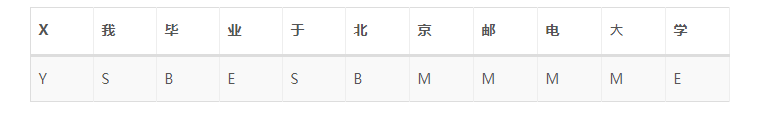
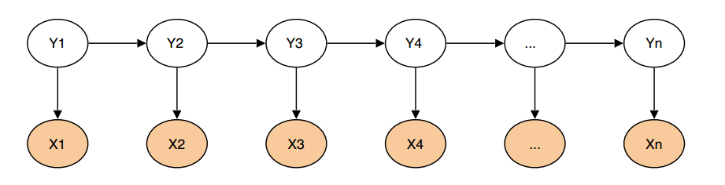
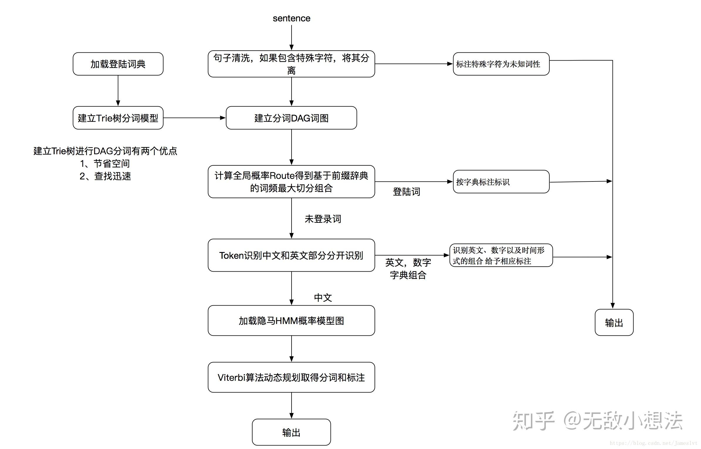
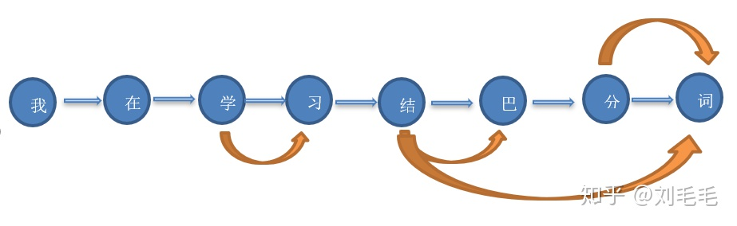
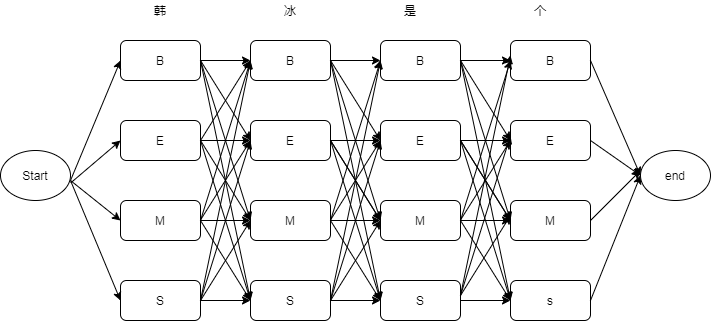
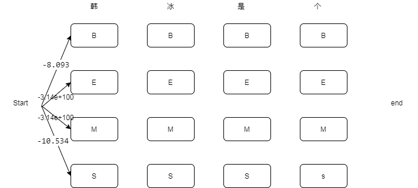
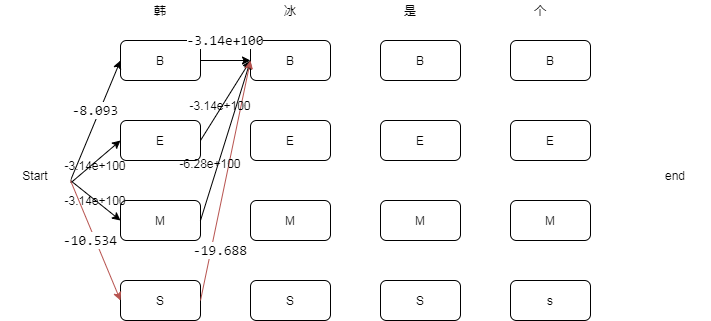
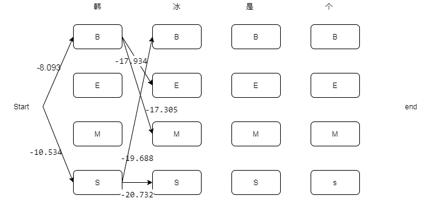
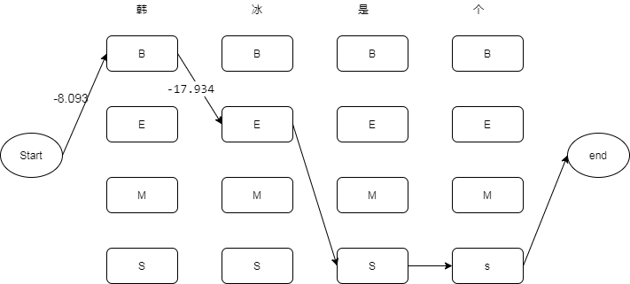

# 中文分词
与大部分印欧语系的语言不同，中文在词与词之间没有任何空格之类的显示标志指示词的边界。因此，中文分词是很多自然语言处理系统中的基础模块和首要环节。


## 中文分词基本原理
从20世纪80年代或更早的时候起，学者们研究了很多的分词方法，这些方法大致可以分为三大类：

基于词表的分词方法
- 正向最大匹配法(forward maximum matching method, FMM)
- 逆向最大匹配法(backward maximum matching method, BMM)
- N-最短路径方法
基于统计模型的分词方法
- 基于N-gram语言模型的分词方法
基于序列标注的分词方法
- 基于HMM的分词方法
- 基于CRF的分词方法
- 基于词感知机的分词方法
- 基于深度学习的端到端的分词方法

在这里只介绍jieba分词用到的**基于N-gram语言模型的分词方法**和**基于HMM的分词方法**


### 基于N-gram语言模型的分词方法
假设随机变量S为一个汉字序列，W是S上所有可能的切分路径。对于分词，实际上就是求解使条件概率P(W∣S)最大的切分路径W∗，即
$$
W^*=\mathop{\arg\max}\limits_{W}P(W|S)
$$
根据贝叶斯公式
$$
W*=\mathop{\arg\max}\limits_{W}\frac{P(W)P(S|W)}{P(S)}
$$
由于P(S)为归一化因子，P(S∣W)恒为1，因此只需要求解P(W)。P(W)使用N-gram语言模型建模，定义如下(以Bi-gram为例)：
$$
P(W)=P(w_0,w_1,...w_n)=P(w_0)P(w_1|w_0)P(w_2|w_1)...P(w_n|w_{n-1})=P(w_0)\prod \limits_{t=1}^nP(w_n|w_{n-1})
$$
至此，各切分路径的好坏程度(条件概率P(W∣S))可以求解。简单的，可以根据DAG枚举全路径，暴力求解最优路径；也可以使用动态规划的方法求解，jieba中不带HMM新词发现的分词，就是DAG + Uni-gram的语言模型 + 后向DP的方式进行的。


### 基于HMM的分词方法
该方法属于由字构词的分词方法，由字构词的分词方法思想并不复杂，它是将分词问题转化为字的分类问题（序列标注问题）。从某些层面讲，由字构词的方法并不依赖于事先编制好的词表，但仍然需要分好词的训练语料。

规定每个字有4个词位：
- 词首 B
- 词中 M
- 词尾 E
- 单字成词 S



由于HMM是一个生成式模型，X为观测序列，Y为隐序列。基于HMM的两个假设
- 齐次马尔科夫性假设，即假设隐藏的马尔科夫链在任意时刻t的状态只依赖于其前一时刻的状态，与其它时刻的状态及观测无关，也与时刻t无关；
- 观测独立性假设，即假设任意时刻的观测只依赖于该时刻的马尔科夫链的状态，与其它观测和状态无关，

HMM模型中的五元组表示：
- 观测序列
- 隐藏状态序列
- 状态初始概率
- 状态转移概率
- 状态发射概率

最的模型为：
$$
P(X, Y)=P(y_0)P(y_0|x_0)\prod \limits_{t=1}^nP(y_t|y_{t-1})P(x_t|y_t)
$$


其中X为观测序列，Y为隐藏状态序列（B，M，E，S）,$P(y_0)$位状态初始概率，$P(y_t|y_{t-1})$为状态转移概率，$P(x_t|y_t)$为状态发射概率。

HMM模型有三个基本问题：

- 概率计算问题，HMM的五元组，计算在模型下给定隐藏序列Y，计算观测序列X出现的概率也就是Forward-backward算法；

- 学习问题，已知观测序列{X}，隐藏序列{Y} ，估计模型的状态初始概率，状态转移概率和状态发射概率 ，使得在该模型下观测序列X的概率尽可能的大，即用极大似然估计的方法估计参数；

- 预测问题，也称为解码问题，已知模型状态初始概率，状态转移概率和状态发射概率和观测序列X，求最大概率的隐藏序列Y。

其中，jieba分词主要中主要涉及第三个问题，也即预测问题。计算方法会涉及到维特比算法，这个后面会结合代码讲到。


## jieba分词
下面我们以jieba分词为例，结合上满介绍的原理和代码介绍一下分词的内部原理，并参考jieba分词源码给出一个简单的实现版本。
jieba的分词过程可以概括为以下几个步骤
- 依据统计词典（模型中这部分已经具备，也可自定义加载）构建统计词典中词的前缀词典。
- 对输入的内容按照子句进行分割（使用正则表达式，以标点符号或者非中文字符为分界）。
- 依据前缀词典对输入的句子进行DAG（有向无环图）的构造。
- 使用动态规划的方法在DAG上找到一条概率最大路径，依据此路径进行分词。
- 对于未收录词（是指不在统计词典中出现的词，未收录词怎么识别可以看完第三部分之后思考一下），使用HMM(隐马尔克夫模型)模型，用Viterbi（维特比）算法找出最可能出现的隐状态序列。




### 生成前缀词典
统计词典在jieba包的dict.txt文件中，是开发者已经统计好的词典，第一列代表的是词语，第二列是词频，第三列是词性，我们主要用到前两列信息，词性这部分，这里没有涉及。我们先看一下词典中的部分内容：


```python
import random

with open("assets/dict.txt") as f:
    lines = f.readlines()
    for line in random.choices(lines, k=5):
        print(line)
```

    孟玉楼 3 nr
    
    斗蓬 3 ns
    
    铁法官 3 n
    
    羿射九日 3 nr
    
    占金丰 4 nr
    
    

当程序运行的时候，它会加载统计词典生成前缀词典，前缀词典是表示什么的呢，我们举个简单的例子。

比如统计词典中含有如下词语
```
我  123
在  234
学习  456
结巴  345
分词  456
结巴分词  23
学  2344
分  23
结 234
```
则前缀词典构造如下，它是将在统计词典中出现的每一个词的每一个前缀提取出来，统计词频，如果某个前缀词在统计词典中没有出现，词频统计为0，如果这个前缀词已经统计过，则不再重复。
```
我 123
在  234
学  2344
学习  456
结  234
结巴  345
结巴分  0
结巴分词  23
分 23
分词  456
```
这里把未出现的统计词也统计出来，且词频统计为0，是为了后面构造DAG方便。生成前缀词典的代码如下，在jieba分词中前缀词典一般会进行缓存，不需要每次分词都重新加载。


```python
def get_prefix_dict(f_name):
    lfreq = {}
    ltotal = 0
    f = open(f_name)
    for lineno, line in enumerate(f, 1):
        try:
            line = line.strip()
            word, freq = line.split(' ')[:2]
            freq = int(freq)
            lfreq[word] = freq
            ltotal += freq
            for ch in range(len(word)):
                wfrag = word[:ch + 1]
                if wfrag not in lfreq:
                    lfreq[wfrag] = 0
        except ValueError:
            raise ValueError(
                'invalid dictionary entry in %s at Line %s: %s' % (f_name, lineno, line))
    f.close()
    return lfreq, ltotal

freq, total = get_prefix_dict("assets/dict.txt")
print("生成前缀词典的大小为{}。".format(total))
```

    生成前缀词典的大小为60102007。
    

### 分割子句
假如我们要对`"我爱结巴分词。我叫孙悟空，我爱北京，我爱Python和C++。 《机器翻译》这本书是我的最爱。"`这句话进行分词，我们首先要把它们划分为子句，第一个原因是标点符号是天然的词语间隔，我们的词语中不会包含标点符号。第二个原因是我们的词典中可能没有包含标点符号的内容，我们应当以这些非中文字符、标点字符作为分界，将输入内容划分为子句，对每个子句进行分词。

一个可行的实现方法是列举所有在中文词典中可能会出现的字符，将连续出现的这些字符作为一个子句进行划分，这些字符之外的其他符号，我们便可以认为是中文标点符号，并把他们作为子句划分标志。我们可以简单的使用正则表达式来完成，出现在中文词典中的字符可能是中文字符、阿拉伯数字、英文字母、+=.等部分英文数字标点。


```python
import re

example = "我爱结巴分词。我叫孙悟空，我爱北京，我爱Python和C++。 《机器翻译》这本书是我的最爱。"

# 列举所有中文词中可能包含的字符
re_han_default = re.compile("([\u4E00-\u9FD5a-zA-Z0-9+#&\._%\-]+)", re.U)

# 将连续出现的合法字符作为一个子句的划分
blocks = re_han_default.split(example)

print(blocks)

```

    ['', '我爱结巴分词', '。', '我叫孙悟空', '，', '我爱北京', '，', '我爱Python和C++', '。 《', '机器翻译', '》', '这本书是我的最爱', '。']
    

我们看到我们已经将整句话分割成子句，每个子句中不再包含标点符号。对于标点符号部分，单独的标点符号我们可以将它直接作为一个单词，而对于`'。 《'`这种情况，我们可以用空白字符\t\r\n将它们进一步分开。


```python
re_skip_default = re.compile("(\r\n|\s)", re.U)

example = "。 《"

words = re_skip_default.split(example)

print(words)
```

    ['。', ' ', '《']
    

### 构造DAG
我们来讲解一下程序里是怎么存储“DAG”的，程序实现图的构建是存储为字典形式的，以每个字所在的位置为键值key，相应划分的末尾位置构成的列表为value，相应划分的末尾位置指的是什么呢，我们举例来说明

“我在学习结巴分词”
在这句话里，我们将每一个字用所在位置来代表，比如0代表“我”，4代表“结”，针对“结”，我们可以在前缀词典里看到以“结”为前缀的词“结”，“结巴”，“结巴分词”的词频大于0，因此“结”，“巴”，“词”为相应划分的末尾位置，因此键值4的value为[4,5,7]，其他键值的对应value统计如下
```
0 ：[0]
1 ：[1]
2 ：[2,3]
3 ：[3]
4 ：[4,5,7]
5 ：[5]
6 ：[6,7]
7 ：[7]
```
注：每一个字都将其自己作为相应划分的末尾位置，即使这个字不在统计词典里。

基于以上构建的键值对，我们将有向图可视化一下，以便方便理解。


从“我”到“词”的路径有以下10种
```
我/在/学/习/结/巴/分/词
我/在/学习/结巴分词
我/在/学习/结/巴/分/词
我/在/学习/结巴/分词
我/在/学习/结/巴/分词
我/在/学习/结巴/分/词
我/在/学/习/结/巴/分词
我/在/学/习/结巴/分/词
我/在/学/习/结巴分词
我/在/学/习/结巴/分词
```


```python
def get_DAG(sentence, freq):
    DAG = {}
    N = len(sentence)
    for k in range(N):
        tmplist = []
        i = k
        frag = sentence[k]
        while i < N and frag in freq:
            if freq[frag]:
                tmplist.append(i)
            i += 1
            frag = sentence[k:i + 1]
        if not tmplist:
            tmplist.append(k)
        DAG[k] = tmplist
    return DAG

example = "我在学习结巴分词"
dag = get_DAG(example, freq)
print(dag)
```

    {0: [0], 1: [1], 2: [2, 3], 3: [3], 4: [4, 5, 7], 5: [5], 6: [6, 7], 7: [7]}
    

### 动态规划找到最大路径
接下来我们需要计算上面10条路径那一条的可能性最大，将可能性最大的那条路径对应的划分作为我们的分词结果。
$$
W^*=\mathop{\arg\min}\limits_{W}P(W)
$$
其中$W$为句子的一个划分，${w_1,w_2,...wn}$
$$
P(W)=P(w_1,w_2...wn)=\prod \limits_{i=0}^nP(w_n)
$$

每一个词出现的概率等于该词在前缀里的词频除以所有词的词频之和。如果词频为0或是不存在，当做词频为1来处理。
$$
P(w_n)=\frac{freq[w_n]+1}{total}
$$

这里会取对数概率，即在每个词概率的基础上取对数，一是为了防止下溢，二后面的概率相乘可以变成相加计算。

最后我们使用动态规划算法算出概率最大的路径。


```python
from math import log

def clac(sentence, DAG, freq, total):
    n = len(sentence)
    route = {n: (0, 0)}
    log_total = log(total)

    for i in range(n-1, -1, -1):
        cache = []
        for j in DAG[i]:
            log_p = log(freq.get(sentence[i:j+1], 0) or 1)
            cache.append((log_p - log_total + route[j+1][0], j))
        route[i] = max(cache)
    return route

route = clac(example, dag, freq, total)
print(route)


```

    {8: (0, 0), 7: (-9.257210763727148, 7), 6: (-14.967114814124178, 7), 5: (-24.384334710144643, 5), 4: (-14.222674339176683, 7), 3: (-25.03090606994119, 3), 2: (-22.62511739105392, 3), 1: (-27.038731622224248, 1), 0: (-32.24695578526084, 0)}
    

通过上面的计算结果，`route`中的key代表最优路径中当前词的起始位置，value的第二个元素代表最优路径中当前词的末尾位置，通过这两个量我们可以推出一个初步的基于词典和词频的分词结果。


```python
def cut_no_hmm(sentence, route):
    i = 0
    while(i < len(route)-1):
        j = route[i][1]
        yield sentence[i:j+1]
        i = j + 1

for word in cut_no_hmm(example, route):
    print(word)
```

    我
    在
    学习
    结巴分词
    

### HMM算法对于未登录词的识别
在jieba分词中，基于HMM的分词主要是作为基于Uni—gram分词的一个补充，主要是解决OOV（out of vocabulary）问题的，它的作用是对未登录词典的词进行识别发现。我们首先用一个例子说明HMM的重要性。比如我们要对一个包含人名的句子进行分词，“韩冰是个好人”。“韩冰”这个词不在词典之中，所以前面基于词典+Uni-Gram语言模型的方法进行分词就会将“韩冰”这个人名分成“韩”+“冰”。所以我们需要一个有一定泛化能力的机器学习模型对这些新词进行发现。


```python
example = "韩冰是个好人"
dag = get_DAG(example, freq)
route = clac(example, dag, freq, total)

list(cut_no_hmm(example, route))
```


    ['韩', '冰', '是', '个', '好人']


使用HMM进行分词的原理在前面已经介绍过了。利用HMM模型进行分词，主要是将分词问题视为一个序列标注（sequence labeling）问题，其中，句子为观测序列，分词结果为状态序列。首先通过语料训练出HMM相关的模型，然后利用Viterbi算法进行求解，最终得到最优的状态序列，然后再根据状态序列，输出分词结果。

这里的状态序列的元素有四种
- "B":Begin（这个字处于词的开始位置）
- "M":Middle（这个字处于词的中间位置）
- "E":End（这个字处于词的结束位置）
- "S":Single（这个字是单字成词）}

由于分词算法术语HMM的预测问题（已知模型状态初始概率，状态转移概率和状态发射概率和观测序列X，求最大概率的隐藏序列Y），所以我们需要在已经进行标注的数据集上训练我们模型的参数，也就是初始概率，状态转移概率和状态发射概率。这里jieba分词中包含了一个已经训练好的模型，至于模型数据来源和训练方法，这里不再赘述，可以参考[模型的数据是如何生成的？]https://github.com/fxsjy/jieba/issues/7 。这里我们直接将模型加载进来用。


```python
import pickle
import math

prob_start = pickle.load(open("./assets/prob_start.p", "rb"))  # 初始概率参数
prob_emit = pickle.load(open("./assets/prob_emit.p", "rb"))  # 发射概率
prob_trans = pickle.load(open("./assets/prob_trans.p", "rb"))  # 状态转移概率
```

首先是初始概率，及输入观察序列（带分词句子）首个字符是"B","M", "E", "S"的概率（这里的概率也进行了对数运算及log(p)）。由这个概率值可以看出，句子首字单字成词（S）和作为词的词首（B）的概率较高，作为词中和词尾概率为0，也比较符合我们的常识。


```python
# 为了直观，将log概率转化为真实概率
{key:math.exp(value) for key, value in prob_start.items()}
```


    {'B': 0.7689828525554734, 'E': 0.0, 'M': 0.0, 'S': 0.2310171474445266}


接下来是状态转移概率，及"B","M", "E", "S"四个状态之间相互转化的概率。


```python
{key: {k: math.exp(v) for k, v in value.items()} for key, value in prob_trans.items()}
```


    {'B': {'E': 0.6000000000000004, 'M': 0.4},
     'E': {'B': 0.5544853051164425, 'S': 0.44551469488355755},
     'M': {'E': 0.7164487459986911, 'M': 0.2835512540013088},
     'S': {'B': 0.48617017333894563, 'S': 0.5138298266610544}}


最后是发射概率，即在观测序列是某个字的情况下，被标注为"B","M", "E", "S"的概率


```python
# 由于这个表比较大，所以随机挑选一些出来看
{key: {k: math.exp(v) for i, (k, v) in enumerate(value.items()) if i < 5} for key, value in prob_emit.items()}

```


    {'B': {'一': 0.025874486447195644,
      '丁': 0.0002960323136559398,
      '七': 0.0004026703175442123,
      '万': 0.0018186831560606151,
      '丈': 0.00014100868588615948},
     'E': {'一': 0.002369710374262949,
      '丁': 0.000114401037236071,
      '七': 0.00010115647270757471,
      '万': 0.00047351540431744344,
      '丈': 0.00012050479628052327},
     'M': {'一': 0.01193645010412285,
      '丁': 0.00035872815397116633,
      '七': 0.001416288550382968,
      '万': 0.0021550909026310924,
      '丈': 8.165936412282943e-05},
     'S': {'∶': 1.3353987946490163e-07,
      '一': 0.007272247985959882,
      '丁': 0.00012041958630747509,
      '丂': 6.67699397324508e-08,
      '七': 0.00025622964372327994}}


有了模型，接下来就可以用viterbi算法对给定的序列进行分词。还拿上面的例子举例 "韩冰是个好人" -> \['韩', '冰', '是', '个', '好人'\]，对于已经成词的部分“好人”，我们不需要对它进行计算了，我们只需要将还是单个字的序列“韩冰是个”放入到HMM模型中进行分词，也就是将这四个字分别打上 “BEMS”标签。并且我们期望的标签是\['韩'->B, '冰'->M, '是'->S, '个'->S\]。首先我们简单介绍一下维特比算法。

#### Viterbi算法
viterbi维特比算法解决的是篱笆型的图的最短路径问题，图的节点按列组织，每列的节点数量可以不一样，每一列的节点只能和相邻列的节点相连，不能跨列相连，节点之间有着不同的距离，距离的值就不在图上一一标注出来了，大家自行脑补。


过程非常简单：

为了找出Start到End之间的最短路径，我们先从Start开始从左到右一列一列地来看。首先起点是Start，从Start到“韩”字对应的状态列的路径有四种可能：Start-B、Start-E、Start-M，Start-S。对应的路径长度即




```python
import sys

MIN_FLOAT = -3.14e100
start_2_B = prob_emit["B"].get("韩", MIN_FLOAT) + prob_start["B"]
start_2_E = prob_emit["E"].get("韩", MIN_FLOAT) + prob_start["E"]
start_2_M = prob_emit["M"].get("韩", MIN_FLOAT) + prob_start["M"]
start_2_S = prob_emit["S"].get("韩", MIN_FLOAT) + prob_start["S"]

print(start_2_B, start_2_E, start_2_M, start_2_S)
```

    -8.093263409081425 -3.14e+100 -3.14e+100 -10.534873750321356
    

我们不能武断地说这四条路径中中的哪一段必定是全局最短路径中的一部分，目前为止任何一段都有可能是全局最优路径的备选项。我们继续往右看，到了“冰”这一列列。按照四个状态进行逐一分析，先看到达“冰”(B)节点的各个路径长度。



以上这四条路径，各节点距离加起来对比一下，我们就可以知道其中哪一条是最短的。因为Start-B-B是最短的，那么我们就知道了经过“冰”(B)的所有路径当中Start-B-B是最短的，其它三条路径路径都比Start-B-B长，绝对不是目标答案，可以大胆地删掉了。删掉了不可能是答案的路径，就是viterbi算法（维特比算法）的重点，因为后面我们再也不用考虑这些被删掉的路径了。现在经过“冰”(B)的所有路径只剩一条路径了(红色标识)


```python
B_2_B = start_2_B + prob_trans["B"].get("B", MIN_FLOAT) + prob_emit["B"].get("冰", MIN_FLOAT)
E_2_B = start_2_E + prob_trans["E"].get("B", MIN_FLOAT) + prob_emit["B"].get("冰", MIN_FLOAT)
M_2_B = start_2_M + prob_trans["M"].get("B", MIN_FLOAT) + prob_emit["B"].get("冰", MIN_FLOAT)
S_2_B = start_2_S + prob_trans["S"].get("B", MIN_FLOAT) + prob_emit["B"].get("冰", MIN_FLOAT)

print(B_2_B, E_2_B, M_2_B, S_2_B)
```

    -3.14e+100 -3.14e+100 -6.28e+100 -19.68864099798377
    

以此类推，我们可以分别找出到达“冰”字对应列的所有四个状态的最优路径。



对后面的“是”，“个”也进行同样的操作，我们便可以得到一条全局最优路径。



```python
def viterbi(obs, states, start_p, trans_p, emit_p):
    V = [{}]  # tabular
    path = {}
    for y in states:  # init
        V[0][y] = start_p[y] + emit_p[y].get(obs[0], MIN_FLOAT)
        path[y] = [y]
    for t in range(1, len(obs)):
        V.append({})
        newpath = {}
        for y in states:
            em_p = emit_p[y].get(obs[t], MIN_FLOAT)
            (prob, state) = max(
                [(V[t - 1][y0] + trans_p[y0].get(y, MIN_FLOAT) + em_p, y0) for y0 in states])
            V[t][y] = prob
            newpath[y] = path[state] + [y]
        path = newpath

    (prob, state) = max((V[len(obs) - 1][y], y) for y in 'ES')

    return (prob, path[state])

example = "韩冰是个"
prob, path = viterbi(example, "BEMS", prob_start, prob_trans, prob_emit)

for w, s in zip(example, path):
    print(w, "->", s)
```

    韩 -> B
    冰 -> E
    是 -> S
    个 -> S
    

根据HMM输出的结果，我们可以将”韩“->B，”冰“->E合并成为一个新词”韩冰“。所以”韩冰是个好人“的分词结果就是['韩冰', '是', '个', '好人']


```python
def hmm(sentence, start_P, trans_P, emit_P):
    prob, pos_list = viterbi(sentence, 'BMES', start_P, trans_P, emit_P)
    begin, nexti = 0, 0
    # print pos_list, sentence
    for i, char in enumerate(sentence):
        pos = pos_list[i]
        if pos == 'B':
            begin = i
        elif pos == 'E':
            yield sentence[begin:i + 1]
            nexti = i + 1
        elif pos == 'S':
            yield char
            nexti = i + 1
    if nexti < len(sentence):
        yield sentence[nexti:]

def cut_hmm(sentence):
    dag = get_DAG(sentence, freq)
    route = clac(sentence, dag, freq, total)
    i = 0
    buf = ""
    while(i < len(route)-1):
        j = route[i][1] + 1

        if j - i <= 1:
            buf += sentence[i]
        else:
            if buf:
                if len(buf) == 1:
                    yield buf
                else:
                    if buf not in freq:
                        for w in hmm(buf, prob_start, prob_trans, prob_emit):
                            yield w
                    else:
                        for w in buf:
                            yield w
                buf = ""
            yield sentence[i:j]
        i = j
    
    if buf:
        if len(buf) == 1:
            yield buf
            buf = ""
        else:
            if buf not in freq:
                for w in hmm(buf, prob_start, prob_trans, prob_emit):
                    yield w
            else:
                for w in buf:
                    yield w

example = "韩冰是个好人"
for word in cut_hmm(example):
    print(word)
```

    韩冰
    是
    个
    好人
    

### 正则表达式辅助分词
除了上述使用机器学习的方法进行分词之外，在我们翻译语料的分词过程中，经常会遇到一些特殊情况，比如日期、数字、英文单词或者其他符合某个特定规则的词语，在前面的操作中，我们将他们划分到了子句之中，因为词典中某些词也会出现这些字符。但是，对于未出现在词典中的英文、数字、符号组合，我们也希望强制把它们当做一个词进行处理，而不是将它们分开。它们通常很难添加到词典中（因为数字字母的排列组合往往是很大的），却很容易通过一些简单的正则表达式对他们进行处理。
```py
1920.2333  # 浮点数
2020.9.2  # 日期
apple  # 英文词
```
我们来看看如果只用 词典+HMM的方式处理他们会怎么样


```python
sentences = ["最终结果为1920.2333", "今天是2020.9.2", "Apple手机是我的最爱"]
for s in sentences:
    print(list(cut_hmm(s)))
```

    ['最终', '结果', '为', '1', '9', '2', '0', '.', '2', '3', '3', '3']
    ['今天', '是', '2', '0', '2', '0', '.', '9', '.', '2']
    ['A', 'p', 'p', 'l', 'e', '手机', '是', '我', '的', '最', '爱']
    

为了处理这个问题，我们需要把连续的、不在词典中的非汉字字符提取出来。


```python
# 用于提取连续的汉字部分
re_han = re.compile("([\u4E00-\u9FD5]+)")
# 用于分割连续的非汉字部分
re_skip = re.compile("([a-zA-Z0-9\.]+(?:\.\d+)?%?)")

def cut_regx_hmm(sentence):
    blocks = re_han.split(sentence)
    for block in blocks:
        if not block:
            continue
        if re_han.match(block):
            yield from cut_hmm(block)
        else:
            for ss in re_skip.split(block):
                if ss:
                    yield ss

for s in sentences:
    print(list(cut_regx_hmm(s)))  

```

    ['最终', '结果', '为', '1920.2333']
    ['今天', '是', '2020.9.2']
    ['Apple', '手机', '是', '我', '的', '最', '爱']
    

## Putting them together.


```python
import re
import pickle

from math import log

class ChineseTokenizer(object):

    re_han_default = re.compile("([\u4E00-\u9FD5a-zA-Z0-9+#&\._%\-]+)", re.U)
    re_skip_default = re.compile("(\r\n|\s)", re.U)

    # 用于提取连续的汉字部分
    re_han = re.compile("([\u4E00-\u9FD5]+)")
    # 用于分割连续的非汉字部分
    re_skip = re.compile("([a-zA-Z0-9\.]+(?:\.\d+)?%?)")

    MIN_FLOAT = -3.14e100

    @staticmethod
    def get_prefix_dict(f_name):
        lfreq = {}
        ltotal = 0
        f = open(f_name)
        for lineno, line in enumerate(f, 1):
            try:
                line = line.strip()
                word, freq = line.split(' ')[:2]
                freq = int(freq)
                lfreq[word] = freq
                ltotal += freq
                for ch in range(len(word)):
                    wfrag = word[:ch + 1]
                    if wfrag not in lfreq:
                        lfreq[wfrag] = 0
            except ValueError:
                raise ValueError(
                    'invalid dictionary entry in %s at Line %s: %s' % (f_name, lineno, line))
        f.close()
        return lfreq, ltotal

    def __init__(self):
        self.freq, self.total = self.get_prefix_dict("./assets/dict.txt")  # 前缀词典 
        self.prob_start = pickle.load(open("./assets/prob_start.p", "rb"))  # 初始概率参数
        self.prob_emit = pickle.load(open("./assets/prob_emit.p", "rb"))  # 发射概率
        self.prob_trans = pickle.load(open("./assets/prob_trans.p", "rb"))  # 状态转移概率

    def cut(self, sentence):
        blocks = self.re_han_default.split(sentence)
        for blk in blocks:
            # 处理空字符串
            if not blk:
                continue
            if self.re_han_default.match(blk):
                # 处理子句
                for word in self.cut_block(blk):
                    yield word
            else:
                # 处理标点符号、空格等等
                tmp = self.re_skip_default.split(blk)
                for x in tmp:
                    if self.re_skip_default.match(x):
                        # 空格、制表符、换行等一起返回
                        yield x
                    else:
                        # 标点符号等分割成字符返回
                        for xx in x:
                            yield xx


    def cut_block(self, sentence):
        DAG = self.get_DAG(sentence)
        route = self.clac(sentence, DAG)
        x = 0
        buf = ''
        N = len(sentence)
        while x < N:
            y = route[x][1] + 1
            l_word = sentence[x:y]

            # 如果当前为一个字符，加入buffer待HMM进一步分词
            if y - x == 1:
                buf += l_word
            else:
                # 对当前buffer进行分词
                if buf:
                    # 当前buffer只有一个字符，直接yield
                    if len(buf) == 1:
                        yield buf
                        buf = ''
                    else:
                        # 这里加了一层判断，如果词典中存在和当前buffer相同的词，则不需要再用HMM进行切分了。
                        if not self.freq.get(buf):
                            # 讲buffer送入HMM进行分词
                            recognized = self.cut_regx_hmm(buf)
                            for t in recognized:
                                yield t
                        else:
                            for elem in buf:
                                yield elem
                        buf = ''
                yield l_word
            x = y

        # 跳出循环后，可能还有待处理的buffer，进行处理
        if buf:
            if len(buf) == 1:
                yield buf
            elif not self.freq.get(buf):
                recognized = self.cut_regx_hmm(buf)
                for t in recognized:
                    yield t
            else:
                for elem in buf:
                    yield elem
    
    def cut_regx_hmm(self, sentence):
        blocks = self.re_han.split(sentence)
        for block in blocks:
            if not block:
                continue
            if self.re_han.match(block):
                yield from self.cut_hmm(block)
            else:
                for ss in self.re_skip.split(block):
                    if ss:
                        yield ss

    def cut_hmm(self, sentence):
        prob, pos_list = self.viterbi(sentence, 'BMES')
        begin, nexti = 0, 0
        # print pos_list, sentence
        for i, char in enumerate(sentence):
            pos = pos_list[i]
            if pos == 'B':
                begin = i
            elif pos == 'E':
                yield sentence[begin:i + 1]
                nexti = i + 1
            elif pos == 'S':
                yield char
                nexti = i + 1
        if nexti < len(sentence):
            yield sentence[nexti:]

    def viterbi(self, obs, states):
        V = [{}]  # tabular
        path = {}
        for y in states:  # init
            V[0][y] = self.prob_start[y] + self.prob_emit[y].get(obs[0], self.MIN_FLOAT)
            path[y] = [y]
        for t in range(1, len(obs)):
            V.append({})
            newpath = {}
            for y in states:
                em_p = self.prob_emit[y].get(obs[t], self.MIN_FLOAT)
                (prob, state) = max(
                    [(V[t - 1][y0] + self.prob_trans[y0].get(y, self.MIN_FLOAT) + em_p, y0) for y0 in states])
                V[t][y] = prob
                newpath[y] = path[state] + [y]
            path = newpath

        (prob, state) = max((V[len(obs) - 1][y], y) for y in 'ES')

        return (prob, path[state])

    def get_DAG(self, sentence):
        DAG = {}
        N = len(sentence)
        for k in range(N):
            tmplist = []
            i = k
            frag = sentence[k]
            while i < N and frag in self.freq:
                if self.freq[frag]:
                    tmplist.append(i)
                i += 1
                frag = sentence[k:i + 1]
            if not tmplist:
                tmplist.append(k)
            DAG[k] = tmplist
        return DAG

    def clac(self, sentence, DAG):
        n = len(sentence)
        route = {n: (0, 0)}
        log_total = log(self.total)

        for i in range(n-1, -1, -1):
            cache = []
            for j in DAG[i]:
                log_p = log(self.freq.get(sentence[i:j+1], 0) or 1)
                cache.append((log_p - log_total + route[j+1][0], j))
            route[i] = max(cache)
        return route    


sentence1 = "程序员祝海林和朱会震是在孙健的左面和右面, 范凯在最右面。再往左是李松洪"
tokenizer = ChineseTokenizer()
list(tokenizer.cut(sentence1))
```


    ['程序员',
     '祝',
     '海林',
     '和',
     '朱会震',
     '是',
     '在',
     '孙健',
     '的',
     '左面',
     '和',
     '右面',
     ',',
     ' ',
     '范凯',
     '在',
     '最',
     '右面',
     '。',
     '再往',
     '左',
     '是',
     '李松洪']


## 参考
- [Github: jieba](https://github.com/fxsjy/jieba)
- [Github: sacremoses](https://github.com/alvations/sacremoses)
- [知乎：jieba分词的原理](https://zhuanlan.zhihu.com/p/189410443)


