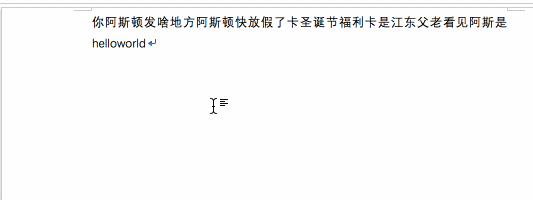

# 规范化

在机器翻译的数据处理过程中，规范化是指对数据中的字符表示或者大小写等进行统一，具体包括符号规范化，大小写转换和中文的简繁体转化等。由于数据来源多样，不同的数据集中可能使用不同的符号标准或者大小写规范等。同一个符号，由于使用的编码不同，计算机也会认为是不同的符号或单词。此外，这种多样性会变相地导致数据中各种符号相对稀疏，增大了模型的学习负担。通过规范化，可以将功能相同的符号或者单词表示进行统一，去除其中的噪音，减小词表规模。

符号规范化，主要指的是全角或者半角符号的统一。如表所示，虽然其中的百分号、字母‘A’和数字‘9’表示的含义没有变，但是在 Unicode 标准中存在不同的编码表示。因此，需要将不同的编码进行统一。在中英翻译中，通常会根据映射规则将符号全部统一成半角符号。

|  字符   | Unicode 编码 16 进制  |
|  :----:  |:----: |
| ％  | FF05 |
| ﹪  | FF6A |
| %  | 25 |
| A  | 41 |
| 9  | 39 |
| ９  | FF19 |

这一步的原理并不复杂，主要是涉及到字符的替换，使用正则相应的正则表达式可以很容易做到。

注:以下的规范化规则均来自[sacremoses](https://github.com/alvations/sacremoses)。是Moses中 [normalize-punctuation.perl](https://github.com/moses-smt/mosesdecoder/blob/master/scripts/tokenizer/normalize-punctuation.perl)脚本的一个python版本，对于大部分场景来说够用了，我们要做的是了解这些通用脚本里面做了什么，对于垂直领域的翻译，需要根据数据的特征在这些通用脚本的基础上进行增删。如果只把它当做黑盒子来用，我们就无法做定制化的开发处理。毕竟数据的清洗质量的好坏也会在很大程度上影响模型训练的效果。

## Unicode中统一字符的替换
### 与引号破折号相关的字符规范化
在英文或者其他语言中引号和破折号是有多种字符表达方式的，它们在表意方面没有任何区别，所以我们通常把它们统一进行替换，如两个单引号替换成双引号，长破折号、短破折号都替换成短破折号。

|  全角字符   | 半角字符  |
|  :----:  |:----: |
| `„`  | `"` |
| `“`  |  `"`|
| `”` | `"`|
| `–` | `-` |
| `—` | ` - ` |
| `´`  | `'` |
| `‘`  | `'` |
| `‚`  | `'` |
| `’`  | `'` |
| `  | `'` |
| `''`  | `"` |
| `''`  | `"` |

### 全角和半角字符
主要涉及到unicode中全角、半角符号之间的转换。因为这些符号在语义上没有区别，如果是英文或者其他拉丁语系可以统一转换成半角字符，如果是中文可以也统一转换为半角字符，在translate的后处理阶段将其恢复为全角字符。可以减少这些符号在翻译时由于不统一引起的歧义，并减少词表的大小，同时也减少了后续分词时的处理复杂度（分词时不需要考虑两套符号的影响了）。

|  全角字符   | 半角字符  |
|  :----:  |:----: |
| `，`  | `,` |
| `。`  |  `.`|
| `、` | `,`|
| `”` | `"` |
| `“` | `"` |
| `∶`  | `:` |
| `：`  | `:` |
| `？`  | `?` |
| `《`  | `<` |
| `》`  | `>` |
| `）`  | `)` |
| `！`  | `!` |
| `（`  | `(` |
| `；`  | `;` |
| `０`  | `0` |
| `１`  | `1` |
| `２`  | `2` |
| `３`  | `3` |
| `４`  | `4` |
| `５`  | `5` |
| `６`  | `6` |
| `７`  | `7` |
| `８`  | `8` |
| `９`  | `9` |
| `．`  | `.` |
| `～`  | `~` |
| `’`  | `,` |
| `…`  | `...` |
| `━`  | `-` |
| `〈`  | `<` |
| `〉`  | `>` |
| `【`  | `[` |
| `】`  | `]` |
| `％`  | `%` |


```python
NORMALIZE_UNICODE = [ # lines 37 - 50
        (u'„', r'"'),
        (u'“', r'"'),
        (u'”', r'"'),
        (u'–', r'-'),
        (u'—', r' - '),
        (r' +', r' '),
        (u'´', r"'"),
        (u'([a-zA-Z])‘([a-zA-Z])', r"\g<1>'\g<2>"),
        (u'([a-zA-Z])’([a-zA-Z])', r"\g<1>'\g<2>"),
        (u'‘', r"'"),
        (u'‚', r"'"),
        (u'’', r"'"),
        (r"''", r'"'),
        (u'´´', r'"'),
        (u'…', r'...'),
    ]

REPLACE_UNICODE_PUNCTUATION = [
    (u"，", u","),
    (r"。\s*", u". "),
    (u"、", u","),
    (u"”", u'"'),
    (u"“", u'"'),
    (u"∶", u":"),
    (u"：", u":"),
    (u"？", u"?"),
    (u"《", u'"'),
    (u"》", u'"'),
    (u"）", u")"),
    (u"！", u"!"),
    (u"（", u"("),
    (u"；", u";"),
    (u"」", u'"'),
    (u"「", u'"'),
    (u"０", u"0"),
    (u"１", u'1'),
    (u"２", u"2"),
    (u"３", u"3"),
    (u"４", u"4"),
    (u"５", u"5"),
    (u"６", u"6"),
    (u"７", u"7"),
    (u"８", u"8"),
    (u"９", u"9"),
    (r"．\s*", u". "),
    (u"～", u"~"),
    (u"’", u"'"),
    (u"…", u"..."),
    (u"━", u"-"),
    (u"〈", u"<"),
    (u"〉", u">"),
    (u"【", u"["),
    (u"】", u"]"),
    (u"％", u"%"),
]

text = "０《１２３》 ４５６％ 【７８９】…"
for regx, sub in NORMALIZE_UNICODE:
    text = re.sub(regx, sub, text)
    
for regx, sub in REPLACE_UNICODE_PUNCTUATION:
    text = re.sub(regx, sub, text)

print(text)
```


    ---------------------------------------------------------------------------

    NameError                                 Traceback (most recent call last)

    <ipython-input-1-7fc3e223095e> in <module>
         58 text = "０《１２３》 ４５６％ 【７８９】…"
         59 for regx, sub in NORMALIZE_UNICODE:
    ---> 60     text = re.sub(regx, sub, text)
         61 
         62 for regx, sub in REPLACE_UNICODE_PUNCTUATION:


    NameError: name 're' is not defined


## 去除额外的空格
需要处理的情况有以下几种

|  情况描述  |  替换内容  | 举例  |
|  :----:  |:----: | :----: |
|  \r(CR) ,将当前位置移到本行开头，会覆盖之前的内容 | 替换为空字符串 | `Hello \rworld` -> `Hello world`|
| 正括号前无空格 | 在正括号前添加空格 | `Hello(world)` -> `Hello (world)` | 
| 反括号后无空格 | 在反括号后添加空格 | `Hello (world)` -> `Hello (world) `| 
| 连续多个空格 | 替换为一个空格 | `Hello  world` -> `Hello world` | 
| 反括号+空格+其他符号| 将反括号与其他符号间空格去掉 | `Hello (world) .`->`Hello (world).`|
| 正括号后有空格| 将空格去掉 | `Hello ( world)` -> `Hello (world)` |
| 反括号前有空格| 将空格去掉 | `Hello (world )` -> `Hello (world)` |
| 数字与百分号之间有空格 | 将空格去掉 | `20 %` -> `20%` |
| 冒号前有空格|将空格去掉|`11 :20` -> `11:20`|
| 分号前有空格|将空格去掉|`hello ; world` -> `hello; world`|


```python
EXTRA_WHITESPACE = [  # lines 21 - 30
    (r"\r", r""),
    (r"\(", r" ("),
    (r"\)", r") "),
    (r" +", r" "),
    (r"\) ([.!:?;,])", r")\g<1>"),
    (r"\( ", r"("),
    (r" \)", r")"),
    (r"(\d) %", r"\g<1>%"),
    (r" :", r":"),
    (r" ;", r";"),
]

text = "The United States in 1805 (color map)                 _Facing_     193"
for regx, sub in EXTRA_WHITESPACE:
    text = re.sub(regx, sub, text)
print(text)
```

## 去除不间断空格（Non-breaking space）
什么是不间断空格呢？在unicode中使用`\u00A0`标识不间断空格。英文写作的时候，我们写的一些词组为了避免他们分开在两行导致人们阅读的时候看不懂，就要把它们写在一起，就用到了不间断空格。这里举个例子来说明。

这里由于我们输入的是普通空格，在输入空格后将hello和world分开了。如果我们输入一个不间断空格，会怎么样呢？

这种空格如果用在单词质检对分词和后续的翻译没有什么影响，但是它经常和一些符号一起出现，我们就需要将它去掉或者做其他处理。譬如`%`,`;`。

|  匹配正则   | 替换  |
|  :----:  |:----: |
| `\u00A0%`  | `%` |
| `nº\u00A0`  |  `nº `|
| `\u00A0:` | `:`|
| `\u00A0ºC` | ` ºC` |
| `\u00A0cm` | ` cm` |
| `\u00A0\\?`  | `?` |
| `\u00A0\\!`  | `!` |
| `\u00A0;`  | `;` |
| `,\u00A0`  | `, ` |

### 规范化数字
如果数字间存在不间断空格，用`.`进行替换。（Moses中是这么做的，这里具体什么原因我也没搞清楚，这里直接写上来）

如`123\u00A0123` -> `123.123`


```python
HANDLE_PSEUDO_SPACES = [ # lines 59 - 67
    (u'\u00A0%', r'%'),
    (u'nº\u00A0', u'nº '),
    (u'\u00A0:', r':'),
    (u'\u00A0ºC', u' ºC'),
    (u'\u00A0cm', r' cm'),
    (u'\u00A0\\?', u'?'),
    (u'\u00A0\\!', u'!'),
    (u'\u00A0;', r';'),
    (u',\u00A0', r', '),
    (r' +', r' '),
]

NORM_NUM = [(u'(\\d)\u00A0(\\d)', r'\g<1>.\g<2>'),]

text = "20{PSEUDO_SPACE}%, 11{PSEUDO_SPACE}22".format(PSEUDO_SPACE="\u00A0")

for regx, sub in HANDLE_PSEUDO_SPACES:
    text = re.sub(regx, sub, text)
    
for regx, sub in NORM_NUM:
    text = re.sub(regx, sub, text)
    
print(text)
```

## 删除控制字符
删除如控制符：LF（换行）、CR（回车）、FF（换页）、DEL（删除）、BS（退格)、BEL（振铃）等。这一步也可以在分词的时候去做。这里不再去写。

